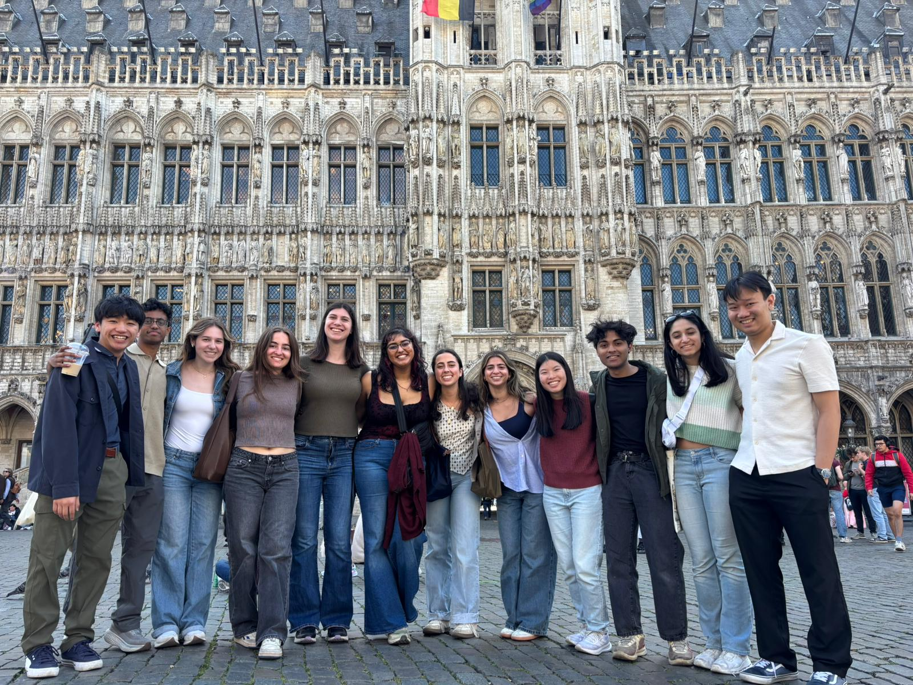

# Experiences and Lessons  

This week has been a mix of exploring Belgium and learning more about data science in action. Walking through the streets of Leuven, trying new foods, and hearing from local guest speakers like Haydn Schofield helped me understand how the EU functions behind the scenes and how they use AI to keep up with new technologies. I was surprised to learn the demand there is for data scientists in institutions like NATO and other European institutions. In class I also worked on pulling data from APIs and using web scraping. Even though there is still a lot of practice I need to do before I master it, I can already tell how much my skills are improving. 

## Here is a picture in the Grand Place! 

# Project Contributions 

My group and I spent a lot of time brainstorming ideas for our projec this past week, focusing on something meaningful that could have a real-world impact. After several conversations and research sessions, we decided to focus on road safety—a topic that’s personally important to me, as my dad works on building safer roads in underdeveloped countries to improve transportation.

Once we settled on the topic, we began searching for relevant data to bring our idea to life. I came across several useful sources, including ones that measured road density and road quality. After gathering everything, we reviewed it as a team and picked the most useful datasets. Since then, we’ve been working with APIs and debugging the data. Right now, I’m focusing on cleaning and organizing information that links road quality scores to EU countries. As we move forward, I plan to keep helping with debugging and applying the data to our machine learning model.
